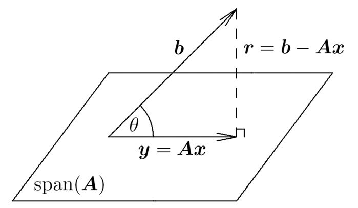

[back](../index.md)

# Least squares method
[source](http://heath.cs.illinois.edu/scicomp/notes/chap03.pdf)

- used when response distribution is continuous and normally distributed. 
- used when assume errors follow a normal distribution.

**overdetermined linear system**: more equations than unknowns, therefore no exact solutions.
In least squares, it means more data points than unknown parameters in the model. (Ax ~= b(or dependent variable)  where A has shape mxn, m > n).

Least squares solution **x** minimizes squared Euclidean norm of residual vector r=b−Ax.  
 Eq.1

## Data fitting
- Given m data points (t_i, y_i), in least squares method we want to find a n-dimensional parameter vector x, which gives best fit y_pred=f(t_i, x), 
  
- It is called "linear" because f (y_pred) is linear wrt x, phi_j depends on t, may not be linear wrt t, 
  
- Problem in matrix form: Ax ~= b. a_ij = phi_j(t_i) and b_i=y_i.  

- This is linear:  
  
- This is nonlinear:  
  

> Vandermonde matrix: columns or rows are successive powers of independent variables.
> E.g. 

## Properties
**Existence**: Linear least squares problem Ax=b always has solution.

**Uniqueness**: solution is unique iff A is linearly independent, i.e., rank(A) = n, where A is mxn and m>n.  
If rank(A)<n, A is *rank-deficient*. If rank(A)=n, A is *full-rank*.

> **Normal Equation** derived by derivatives 
> To solve Eq.1, open bracket and take derivative wrt x and set to 0,  
>   
>   
> This reduces to nxn normal equations,  
>    
> this is solvable (x has a solution) iff A is linearly independent (has full column rank), so we may invert the Gram matrix.  
> A is design matrix, A^T*A is Gram matrix.  

**Orthogonality**: if A is full-rank, y=Ax is closest to b when residue r is orthogonal to span(A).

> **Normal Equation** derived by orthogonality  
> Since A is full-rank of shape mxn and m>n, the space spanned by columns of A is of dimension at most n:  
> span(A) = {Ax: x in R^n} = {x': x'=c1a1+c2a2+...+cnan} (linear combination of col vectors in A).  
> Since m>n, b does not lie in span(A), so *no exact solution* to Ax = b.  
> Since y = Ax, to let y closet to b, r = Ax - b is orthogonal to span(A) (垂线是最短距离).  
> Therefore, 0=A^Tr=A^T(Ax-b), A^TAx=A^Tb, the normal equation.  
> Geometrically,  
>   

## Normal equation methods (solving normal equations)
rectangular -> square -> triangular
- LU factorization
  - A = LU, L is lower triangular, U is upper triangular matrices.
  - forward substitution Ly=b, backward substitution Ux=y.
- Cholesky factorization
  - applicable to symmetric, positive-definite matrices.
  - A = LL^T, L is lower triangular matrix.
- QR factorization
  - Householder transformations
  - Givens rotations
  - Gram-Schmidt orthogonalization
- [Singular value decomposition (SVD)](../subsecs/svd.md)

Skipped content:  
- orthogonal projectors
- pseudoinverse and condition number
- sensitivity and conditioning

[back](../index.md)