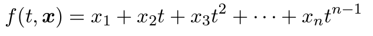

# Least squares method
- used when response distribution is continuous and normally distributed. 
- used when assume errors follow a normal distribution.

**overdetermined linear system**: more equations than unknowns, therefore no exact solutions.
In least squares, it means more data points than unknown parameters in the model. (Ax = b(or y)  where A has shape mxn, m > n).

Least squares solution **x** minimizes squared Euclidean norm of residual vector r=b−Ax.  

## Data fitting
- Given m data points (t_i, y_i), in least squares method we want to find a n-dimensional parameter vector x, which gives best fit y_pred=f(t_i, x), 
  
- It is called "linear" because f (y_pred) is linear wrt x, phi_j depends on t, may not be linear wrt t, 
  
- Problem in matrix form: Ax ~= b. a_ij = phi_j(t_i) and b_i=y_i.  

- This is linear:  
  
- This is nonlinear:  
  

> Vandermonde matrix: columns or rows are successive powers of independent variables.
> E.g. 

