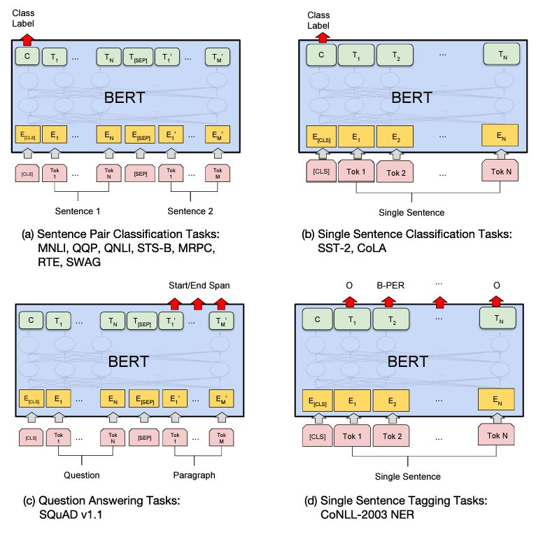

[back](../index.md)

# Bidirectional encoder representations from transformers (BERT)

[BERT: Pre-training of Deep Bidirectional Transformers for Language Understanding](https://arxiv.org/abs/1810.04805) <br>
Authors: Jacob Devlin, Ming-Wei Chang, Kenton Lee, Kristina Toutanova<br>
Year: 2018

Summary:
- similar to GPT:
  - two-stage: pre-training + fine-tuning
  - transformer architecture
- different from GPT:
  - masked language modeling (MLM) 
    - learns bidirectional relationship (*token-level*) (traditional bidirectionality is achieved by training separate models in both 
    the left-to-right and right-to-left directions and then combine their representations.)
  - next sentence prediction (NSP) 
    - learns *sentence-level* relationship and coherence
- use WordPiece tokenization

## Model architecture: transformer
- BERT is a multi-layer *bidirectional transformer encoder*: a bidirectional self-attentive model, uses *all* the tokens 
in a sequence to attend each token in that sequence* ([GPT](../subsecs/gpt.md) is a transformer decoder).

 <br>
- the same architectures are used in both pre-training and fine-tuning.
- the same pre-trained model parameters are used to initialize models for different downstream tasks.
- all parameters are fine-tuned during fine-tuning.
- [CLS] (*'classification token'*) is a special symbol added in front of every input example
- [SEP] is a special separator token (e.g. separating questions/answers)
- [MASK] indicates masked token in MLM task

### Stage 1: pre-training
#### Masked language model (MLM)
- ```masking_rate```: a hyperparameter, indicates percentage of the tokens from each sequence are randomly masked 
(replaced with the token [MASK]), in paper ```masking_rate=15%```
- BERT only predicts the masked tokens rather than reconstructing the entire input
- a downside: [MASK] token does not appear during fine-tuning - a mismatch between pre-training and fine-tuning
- solution presented: bias the representation towards the actual observed words:
  - 80% of the time: mask 15% words
  - 10% of the time: replace words with a random word
  - 10% of the time: unchanged

#### Next sentence prediction (NSP)
- a binary classification task
- used *segment embeddings* <br>

- example <br>


### Stage 2: fine-tuning
> For each task, we simply plug in the task-specific inputs and outputs into BERT and fine-tune all the parameters end-to-end. <br>
> 

## Reference
[BERT: Pre-Training of Transformers for Language Understanding](https://medium.com/swlh/bert-pre-training-of-transformers-for-language-understanding-5214fba4a9af)

[back](../index.md)