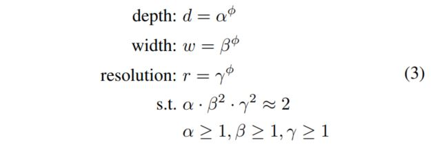

[back](../index.md)

## EfficientNet

[EfficientNet: Rethinking Model Scaling for Convolutional Neural Networks](http://proceedings.mlr.press/v97/tan19a.html)<br>
Aurthors: Mingxing Tan, Quoc Le <br>
Year: 2019 <br>

[Model size comparison](./efficientnet_model.md) <br>
[Model performance](./efficientnet_md_perf.md)

### Main Contribution

**Compound scaling**: 

> use a compound coefficient φ to uniformly scales network width, depth, and resolution in a principled way.<br>
<br>

> α, β, γ are constants that can be determined by a small grid search. Intuitively, φ is a user-specified coefficient that controls how many more resources are available for model scaling, while α, β, γ specify how to assign these extra resources to network width, depth, and resolution respectively. 

### Architecture
<br>

EfficientNet is built using a series of building blocks called `MBConvBlocks`.

The name `MBConvBlocks` comes from [**MobileNet**](./mobilenet.md).

`MBConvBlocks` consists of `DepthwiseConvBlock`, `PointwiseConvBlock`, and `SEBlock`.

#### DepthwiseConvBlock

`DepthwiseConvBlock`: A depthwise convolution is applied to the input tensor. This is a type of convolution that applies a separate filter to each channel of the input tensor without mixing the channels. This allows the network to extract spatial information independently from different input channels. This helps reduce the number of parameters in the model and also helps capture more diverse features.

*   `DepthwiseConvBlock` has the same number of input and output channels.
*   `DepthwiseConvBlock` has kernel size 3x3.

```python
class DepthwiseConvblock(nn.Module):
    def __init__(self, in_channels, kernel_size, stride=1):
        super(DepthwiseConvblock, self).__init__()

        self.depthwise = nn.Conv2d(
            in_channels=in_channels, 
            out_channels=in_channels, 
            kernel_size=kernel_size, 
            #stride=stride, 
            padding='valid', 
            groups=in_channels, 
            bias=False
        )

        self.bn = nn.BatchNorm2d(in_channels)
        self.silu = nn.SiLU()

    def forward(self, x):
        out = self.depthwise(x)
        out = self.bn(out)
        out = self.silu(out)
        return out
```

#### PointwiseConvBlock

`PointwiseConvBlock`: A pointwise convolution is applied to the output of the depthwise convolution. This is a 1x1 convolution that applies a filter to each location in the output tensor. It is used to increase or decrease the number of channels in the output tensor. This is a convolutional operation that uses a 1x1 filter to combine the output channels of the depthwise convolution block. The pointwise convolution helps to increase the expressiveness of the network by allowing it to learn more complex representations of the input data. The pointwise convolution operation applies a C_out filters of size 1x1 to the input feature map, which essentially performs a linear combination of the output channels of the previous convolutional layer.

*   `PointwiseConvBlock` has different number of input and output channels.
*   `PointwiseConvBlock` has kernel size 1x1.

```py
class PointwiseConvBlock(nn.Module):
    def __init__(self, in_channels, out_channels):
        super(PointwiseConvBlock, self).__init__()

        self.pointwise = nn.Conv2d(
            in_channels=in_channels,
            out_channels=out_channels,
            kernel_size=1,
            stride=1,
            padding='valid',
            bias=False
        )
        self.bn = nn.BatchNorm2d(out_channels)
        self.relu = nn.ReLU(inplace=True)

    def forward(self, x):
        out = self.pointwise(x)
        out = self.bn(out)
        out = self.relu(out)
        return out
```

#### SEBlock

`SEBlock`: Squeeze-and-Excitation (SE) Block. The SE block is used to model the interdependencies between channels. It contains a global average pooling layer followed by two fully connected layers and a sigmoid activation function. The output of the sigmoid function is used to re-weight the input feature map before passing it to the next layer. These weights are used to scale the channels of the input tensor to emphasize the most important channels.

```py
class SEBlock(nn.Module):
    def __init__(self, in_channels, reduced_channels):
        super(SEBlock, self).__init__()

        self.pool = nn.AdaptiveAvgPool2d(1)
        self.fc1 = nn.Linear(in_channels, reduced_channels)
        self.relu = nn.ReLU(inplace=True)
        self.fc2 = nn.Linear(reduced_channels, in_channels)
        self.sigmoid = nn.Sigmoid()

    def forward(self, x):
        batch_size, channels, _, _ = x.size()
        out = self.pool(x).view(batch_size, channels)
        out = self.fc1(out)
        out = self.relu(out)
        out = self.fc2(out)
        out = self.sigmoid(out).view(batch_size, channels, 1, 1)
        out = x * out
        return out
```

[back](../index.md)


