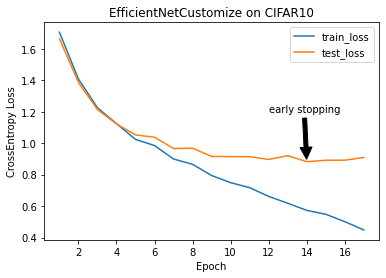

[back](../index.md)

Model: `EfficientNetCustomize` <br>
Dataset: `CIFAR10` <br>
Training details: 

```py
batch_size: 64
RAM: 16GB
GPU: NVIDIA GeForce RTX 2060
```
Early stopping at: 14 <br>
Best training loss: 0.44856093645095824 <br>
Best validation loss: 0.8824604354846249 <br>
Loss graph: <br>


[back](../index.md)