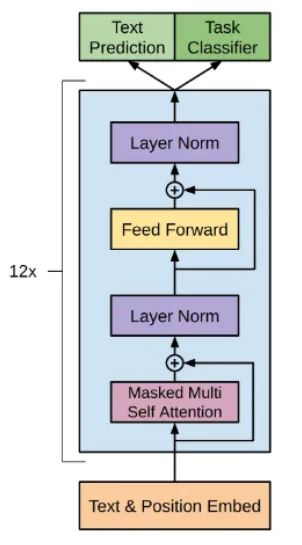
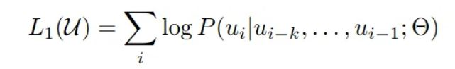
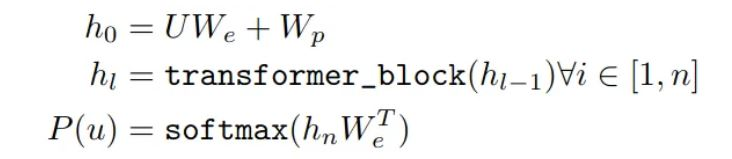
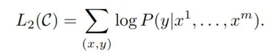
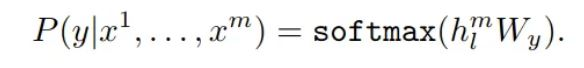
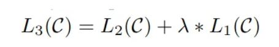
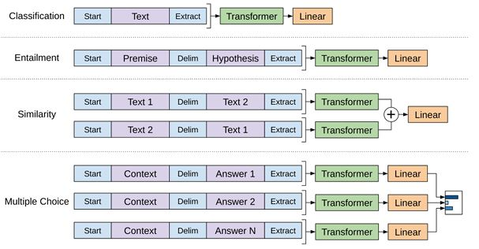

[back](../index.md)

# Generative pre-trained transformers (GPT)

deeplearning.ai course: [ChatGPT Prompt Engineering for Developers]()

[Improving language understanding with unsupervised learning](https://openai.com/research/language-unsupervised)  
Authors: Alec Radford, Karthik Narasimhan, Tim Salimans, Ilya Sutskever 
Year: 2018

Goal of GPT: to learn universal representation of language that can be adapted to downstream tasks by task-specific fine-tuning.

## Framework: **two-stage training procedure**
- unsupervised pre-training: on a large corpus of unlabeled text data
  - objective: predict the next word in a sequence of words given the preceding context.
  - outcome: learned parameters of NN & contextual word embedding.
- supervised fine-tuning: task-specific, adapt the model to a discriminative task with labeled data.

## Model architecture: **transformer**
- Difference between GPT and transformer:
Transformer is a type of NN architecture that can be used for various tasks, 
while GPT is a specific implementation of this architecture.  
- Architectural difference: 
  - GPT uses a multi-layer **transformer decoder**: unidirectional self-attentive model, uses only the tokens *preceding* a given token in the 
  sequence to attend that token (*auto-regressive (AR)*). ([BERT](../subsecs/bert.md) is transformer encoder: bidirectional self-attentive model, 
  uses *all* the tokens in a sequence to attend each token in that sequence.)
  - > the model applies a multi-headed self-attention operation over the input context tokens followed by position-wise 
    feedforward layers to produce an output distribution over target tokens.

> GPT's transformer decoder architecture:  
>  

### Stage 1: unsupervised pre-training
Maximise objective function:  
  
- U: a given corpus contains n tokens, U = {u_1, ..., u_n}
- u_i: i-th token 
- k: context window size, i.e., previous k tokens
- Θ: model parameters, trained using SGD

Attention and probability are calculated through:  
  
- typo: for all l in [1, n]
- U: context vector of tokens, U = (u_(-k),..., u_(-1)), i.e. the target token is at position 0. Shape: (1, k)
- n: number of layers
- W_e: token embedding matrix. Shape: (k, emb_size(hyperparam.))
- W_p: position embedding matrix. Shape: (1, emb_size)
- state h_l is calculated using state h_(l-1)
- P(u): probability distribution of token u. Shape: (1, k)

[comment]: <> (- TODO: add explanation to calculation)

### Stage 2: supervised fine-tuning
Maximize objective function:  
  
- C: a labeled dataset, C_i = {y, x^1, ..., x^m}
- y: label
- x_i: i-th token

where:  
  
- h^{l}_{m}: the final transformer block's activation
- W_y: parameters of the added linear output layer

**complete objective function**:  

## Transfer learning
In order to prevent a significant amount of task-specific customization, GPT
> convert structured inputs into an ordered sequence that our pre-trained model can process.
> 

## Reference
[*OpenAI GPT: Generative Pre-Training for Language Understanding*](https://medium.com/dataseries/openai-gpt-generative-pre-training-for-language-understanding-bbbdb42b7ff4)  
[*A Gentle Introduction to Positional Encoding in Transformer Models, Part 1*](https://machinelearningmastery.com/a-gentle-introduction-to-positional-encoding-in-transformer-models-part-1/)  

[back](../index.md)