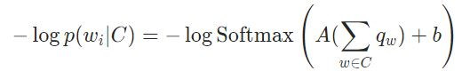
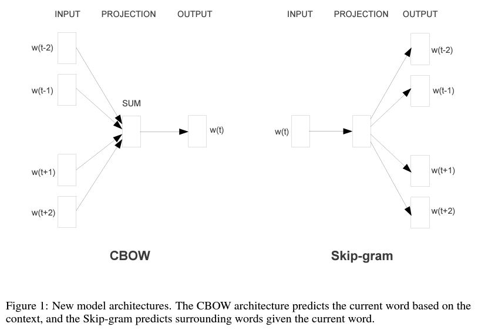

[back](../index.md)

## Word2vec

[Efficient Estimation of Word Representations in Vector Space](https://arxiv.org/abs/1301.3781)<br>
Authors: Tomas Mikolov, Kai Chen, Greg Corrado, Jeffrey Dean <br>
Year: 2013 <br>

[Distributed Representations of Words and Phrases and their Compositionality](https://proceedings.neurips.cc/paper/2013/hash/9aa42b31882ec039965f3c4923ce901b-Abstract.html)<br>
Authors: Tomas Mikolov, Ilya Sutskever, Kai Chen, Greg S. Corrado, Jeff Dean <br>
Year: 2013 <br>

## Main contribution
In paper 1:

**Continuous Bag-of-Words (CBOW) model**
* based on **Feedforward Neural Net Language Model (NNLM)**.
  * predict the n-th word using the previous n-1 words.
  * outputs a probability distribution over the *vocabulary* for the next word.
  * *vocabulary* is a word bank ( the set of all the unique words that can appear in the input or output of the model).
  * 4 components: input layer, projection layer, hidden layers, output layer.
    * input layer: ont-hot encoding the previous n-1 words. The vector length is 1*len(vocabulary).
    * projection layer: map vector to lower dimension space using a learned projection matrix. (sparse -> dense)
      * the projection matrix is not shared among all words. Each word has its own projection matrix.
    * hidden layer: apply nonlinear transformation.
* predict middle word using both future and history words (called *context*), the length is a hyperparameter.
* the order of words doesn't matter in CBOW but matters in Feedforward NNLM.
* CBOW uses a simple averaging operation over input word vectors instead of a non-linear hidden layer.
* CBOW shares the projection layer (i.e., the weight matrix used to produce input word vectors) for all words in the vocabulary, which can greatly reduce the number of parameters.
* CBOW does not need to output probabilistic distribution for a target word, it can output real-value, as a word embedding which is used in downstream tasks.
  * each word has an embedding.
  * called *pretraining embeddings*.

CBOW loss function: <br>


**Continuous Skip-Gram model**
* predict surrounding words based on the middle word.
* the projection matrix is not shared across all words in the vocabulary, but rather each word has its own projection matrix.

## Architecture
 <br>

**CBOW** <br>
[Exercise: Computing Word Embeddings: Continuous Bag-of-Words](https://pytorch.org/tutorials/beginner/nlp/word_embeddings_tutorial.html#exercise-computing-word-embeddings-continuous-bag-of-words) <br>
Use ```nn.Embedding()``` for projection layer, and ```nn.Linear()``` for output layer; <br>
The output from the model's embedding layer, which is the hidden representation of the input word(s), can be used for downstream tasks such as sentiment analysis or text classification.


[back](../index.md)